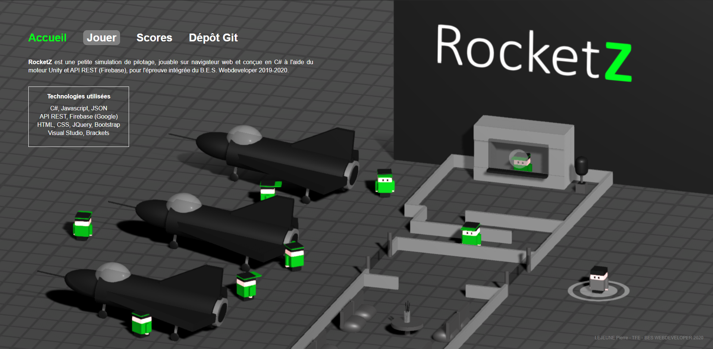

#
# RocketZ

Simulation de pilotage en vue isométrique à l'aide d'Unity + API REST, réalisé pour l'Epreuve intégrée du BES WEBDEVELOPER SeraingSup 2019-2020.

## A propos

Jeu développé en C# dans Unity avec inscription/connexion et sauvegarde des scores via l'API REST de Google (Firebase). Pour vous connecter à votre propre base de données Firebase, remplissez le fichier de configuration "UserController.cs". 

Les scripts écrits pour le projet sont accessibles dans le dossier "code source jeu > Assets > Scripts". Les fichiers pour la réalisation du site web final sont accessibles dans le dossier "site web". 

Le jeu est jouable à [cette adresse](https://lejeune.bes-webdeveloper-seraing.be/ei).

## Authors

* **Pierre Arthur Lejeune** - [RocketZ](https://github.com/plejeune/rocketz)
